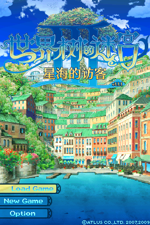
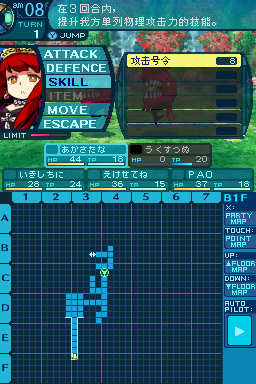

# 《世界树的迷宫III 星海的访客》汉化

## 基本说明

本项目是对 Nintendo DS 游戏《世界树的迷宫III 星海的访客》（世界樹の迷宮III 星海の来訪者）的简体中文本地化。

文本翻译主要来源于[高清重制版](https://store.steampowered.com/app/1810820/)的官方中文翻译，并进行了查缺补漏。

由于高清重制版对立绘进行了替换，因此本项目提供两个版本的补丁：原版立绘和高清重制版立绘。

如需转载，请保留此说明。

## 使用方式

请自行获取游戏日文版 ROM，然后下载修正补丁并解压，按照补丁应用工具“NitroPatcher”的说明进行操作。补丁压缩包中包含了 Microsoft Windows 平台的补丁应用工具，其他平台的工具可通过下方下载地址获取。

日文版 ROM 校验码（[No-Intro](https://datomatic.no-intro.org/index.php?page=show_record&s=28&n=4849)）：

- CRC32：`7673037d`
- MD5：`eb02bcf299f8846ec92b8ddca9ffd3ef`
- SHA-1：`18ab6b3af885180e306898b31271fcec1c3418a9`

修正补丁下载地址：

- GitHub：<https://github.com/Qi-Busiyi-Hanhuazu/EO3ChsLocalization/releases/download/v1.0.0/EO3ChsLocalization.v1.0.0.zip>
- 百度网盘：<https://pan.baidu.com/s/1y5ZgIobZD_wJpviej0jABQ?pwd=bj3j>

补丁应用工具下载地址：

- GitHub：<https://github.com/Xzonn/NitroPatcher/releases/latest/>
- 百度网盘：<https://pan.baidu.com/s/1vXynSX1WauU3FeGHDnrDfg?pwd=ntro>

## 汉化名单

- **技术**：Xzonn
- **美工**：王子泉

## 截图预览
  

## 授权协议

本项目使用 **[CC BY-NC-SA 4.0](https://creativecommons.org/licenses/by-nc-sa/4.0/legalcode)** 协议授权。若您想基于本项目进行二次创作，请遵守协议内容。这些内容主要包括：

- **署名**：您必须标明本项目的作者（Xzonn&王子泉），并在您的作品中提供指向本项目的链接。
- **非商业性使用**：您不得将本项目用于商业目的。
- **相同方式共享**：若您基于本项目进行二次创作，您必须以相同的协议授权您的作品。

请阅读本项目的 **[完整授权协议](LICENSE.txt)** 以了解更多信息。
